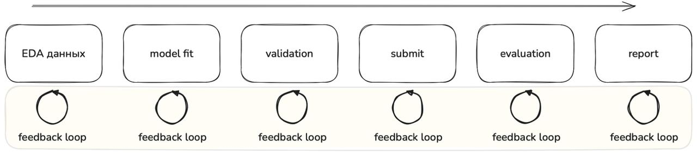
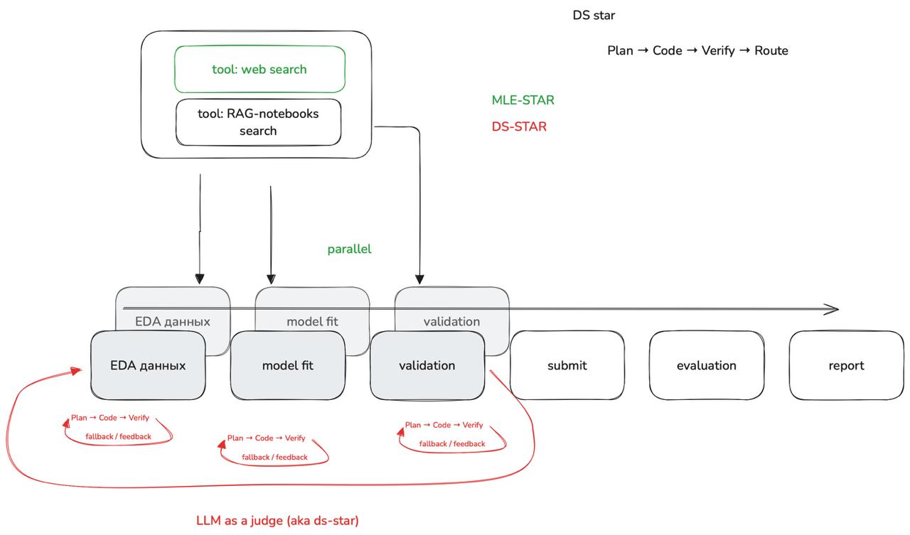

## Обзор

| Файл | Архитектура | Сложность | Использование LLM |
|------|-------------|-----------|-------------------|
| `01_.py` | Линейный пайплайн | Низкая | Опционально (только саммари) |
| `02_.py` | LLM-генерация кода | Средняя | Генерация кода для каждого шага |
| `03_.py` | Supervisor мульти-агент | Высокая | Супервизор + 4 рабочих агента |

---

## 01_.py — Линейный ML-пайплайн (без агента)


Традиционный подход: последовательное выполнение ML-задач без LLM-агентов.

### Шаги пайплайна
1. **EDA** — Загрузка и анализ train/test данных
2. **Train** — Обучение RandomForest классификатора
3. **Local Eval** — Оценка модели на валидационной выборке
4. **Submission** — Генерация submission.csv
5. **Submit** — Отправка в Kaggle через API
6. **Wait Results** — Подтверждение отправки (без polling)
7. **Report** — Генерация финального отчёта

### Ключевые особенности
- Простое, детерминированное выполнение
- Быстро (нет LLM-вызовов для основной логики)
- Легко отлаживать
- Опциональные LLM-саммари (если доступен ChatHuggingFace)

### Запуск
```bash
.venv/bin/python ai_agents_course/final_project/ai_agent_step_by_step/01_.py
```

---

## 02_.py — Агент с LLM-генерацией кода



Агентный пайплайн, где LLM генерирует Python-код для каждого шага. Сгенерированный код выполняется в подпроцессах с логикой повторных попыток.

### Шаги пайплайна
1. **EDA** — LLM генерирует код анализа данных
2. **Train** — LLM генерирует код обучения модели
3. **Eval** — LLM генерирует код оценки
4. **Submission** — LLM генерирует код создания submission
5. **Submit** — Прямая отправка в Kaggle API (без LLM)
6. **Wait Results** — Подтверждение отправки (без LLM)
7. **Report** — LLM генерирует финальный отчёт

### Ключевые особенности
- LLM-генерация Python-кода для каждого шага
- Обратная связь при ошибках (до 3 попыток)
- Сессионные директории с timestamp
- Использует 20% обучающих данных для скорости
- Fallback-функции при ошибках LLM

### Архитектура
```
Запрос пользователя → LLM генерация кода → Валидация кода → Выполнение в подпроцессе → Обновление state
                              ↑                                                                  |
                              └────────────── Обратная связь при ошибке ←──────────────────────┘
```

### Запуск
```bash
.venv/bin/python ai_agents_course/final_project/ai_agent_step_by_step/02_.py
```

---

## 03_.py — Supervisor мульти-агентный пайплайн


Мульти-агентная архитектура с использованием `langgraph-supervisor`. Агент-супервизор координирует специализированных рабочих агентов.

### Архитектура
```
                    Supervisor Agent (Супервизор)
                              |
        +--------------------+--------------------+
        |                    |                    |
   EDA Agent           Train Agent          Eval Agent
   (анализ)            (обучение)           (оценка)
                                                  |
                                           Submit Agent
                                        (создание CSV)
```

### Рабочие агенты
| Агент | Инструменты | Назначение |
|-------|-------------|------------|
| `eda_agent` | `tool_eda_analyze`, `tool_eda_save_report` | Анализ данных |
| `train_agent` | `tool_train_model` | Обучение модели |
| `eval_agent` | `tool_eval_model`, `tool_eval_save_metrics` | Оценка модели |
| `submit_agent` | `tool_submit_create`, `tool_submit_validate` | Создание submission |

### Ключевые особенности
- Супервизор координирует через handoff-инструменты
- Каждый агент имеет специализированные инструменты
- Сессионное хранение артефактов
- Fallback-пайплайн при ошибках супервизора
- Отправка в Kaggle (без агента)
- `recursion_limit=15` для предотвращения бесконечных циклов

### Запуск
```bash
.venv/bin/python ai_agents_course/final_project/ai_agent_step_by_step/03_.py
```

---

## К чему мы идём



Полностью автономный AI-агент, который:
- Сам анализирует задачу соревнования
- Планирует стратегию решения
- Выбирает и настраивает модели
- Итеративно улучшает результаты
- Достигает топовых позиций без участия человека

---

## Требования

### Зависимости
```
pandas
scikit-learn
joblib
kaggle>=1.5.16
langchain-huggingface
langgraph
langgraph-supervisor
openai
python-dotenv
```

### Переменные окружения (`.env`)
```bash
# Kaggle API (новый формат токена)
API_KAGGLE_KEY="KGAT_xxx..."

# OpenRouter для LLM
OPENROUTER_API_KEY="sk-or-v1-..."

# Опционально: переопределить название соревнования
KAGGLE_COMPETITION="mws-ai-agents-2026"
```

### Аутентификация Kaggle
Скрипты используют новый формат токена Kaggle API (`KGAT_xxx`). Установите `API_KAGGLE_KEY` в файле `.env`.

---

## Структура выходных данных

Каждый скрипт создаёт артефакты в `artifacts/sessions/<timestamp>/`:

```
artifacts/
├── sessions/
│   └── 2026-03-16_12-34-56/
│       ├── run.log                 # Лог выполнения
│       ├── submission.csv          # Submission для Kaggle
│       ├── models/
│       │   └── model.joblib        # Обученная модель
│       ├── reports/
│       │   ├── eda_summary.txt
│       │   ├── local_metrics.json
│       │   └── final_report.txt
│       └── code/                   # (только в 02_.py)
│           ├── step1_eda.py
│           ├── step2_train.py
│           └── ...
```
