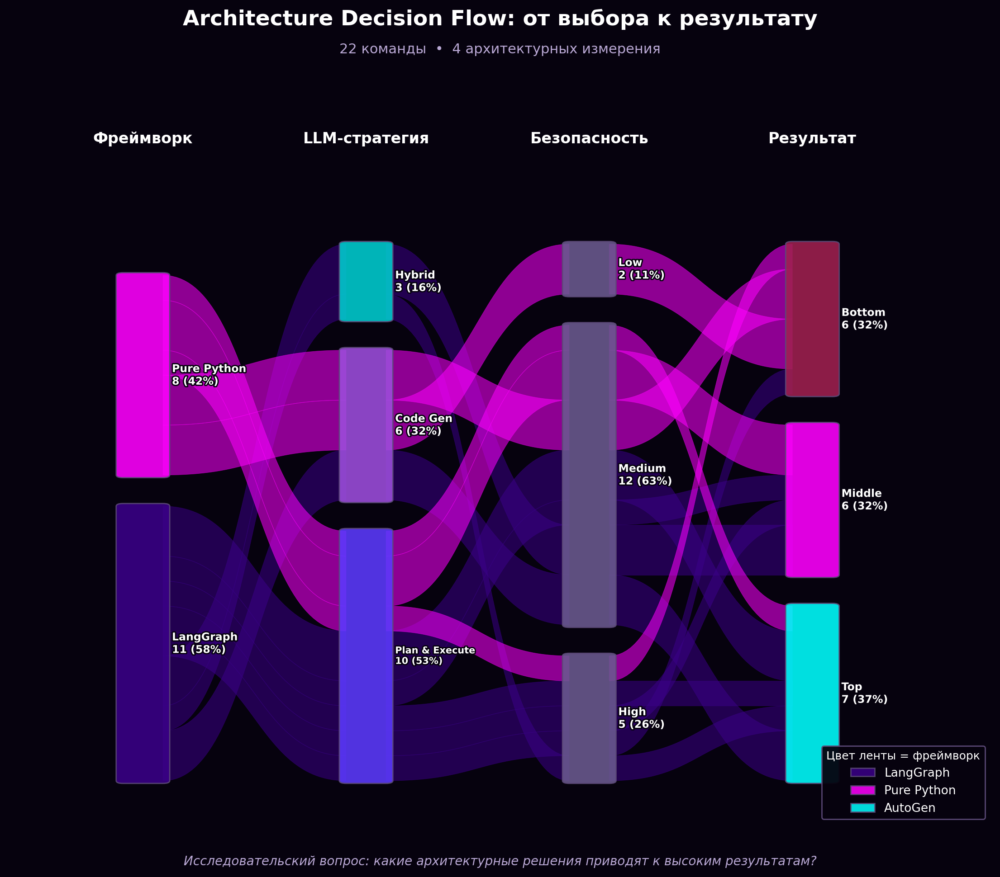
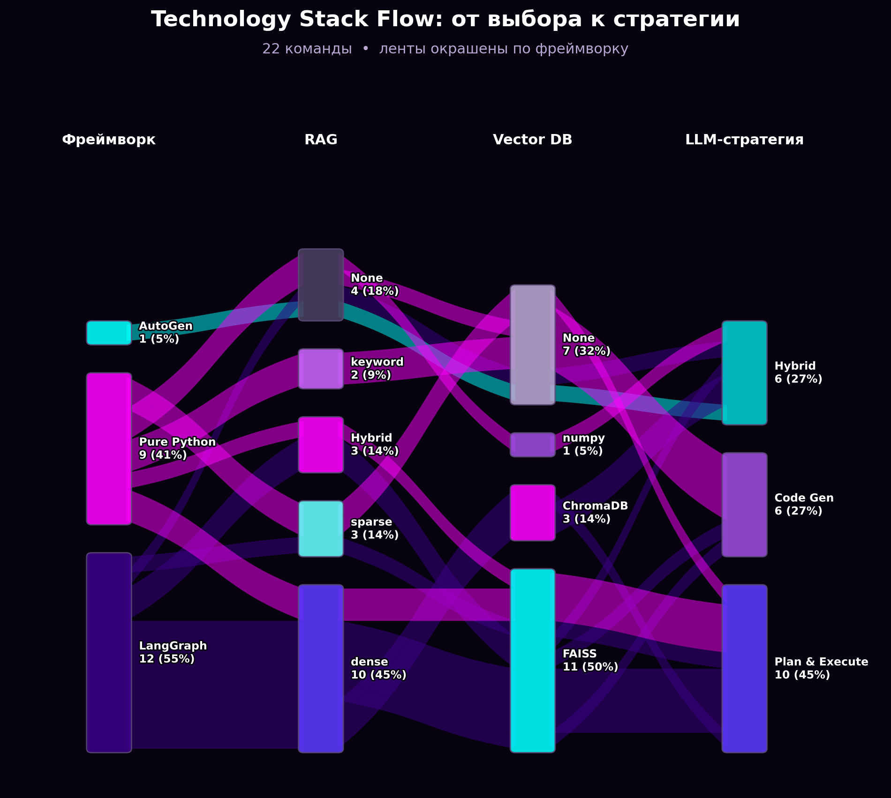
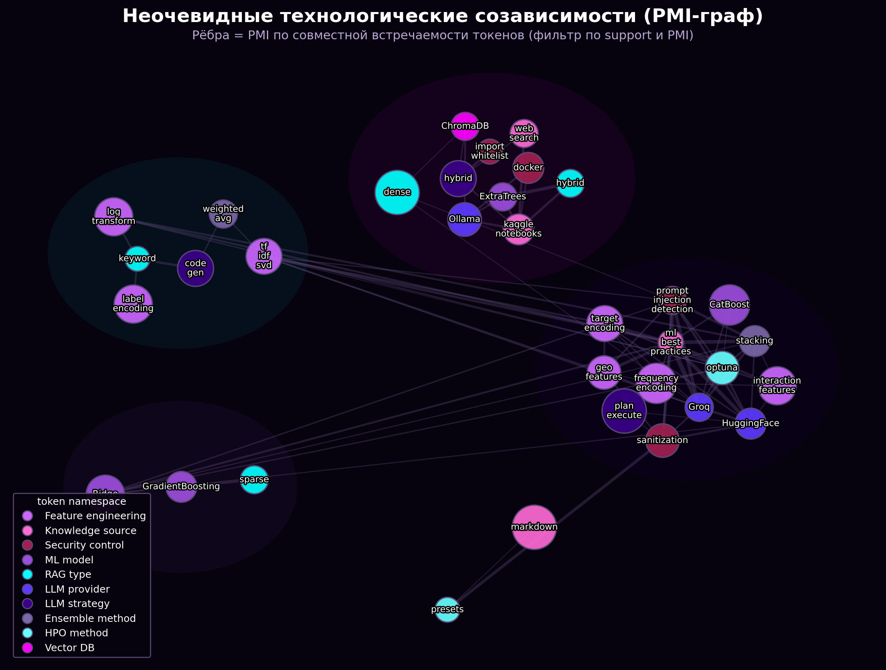
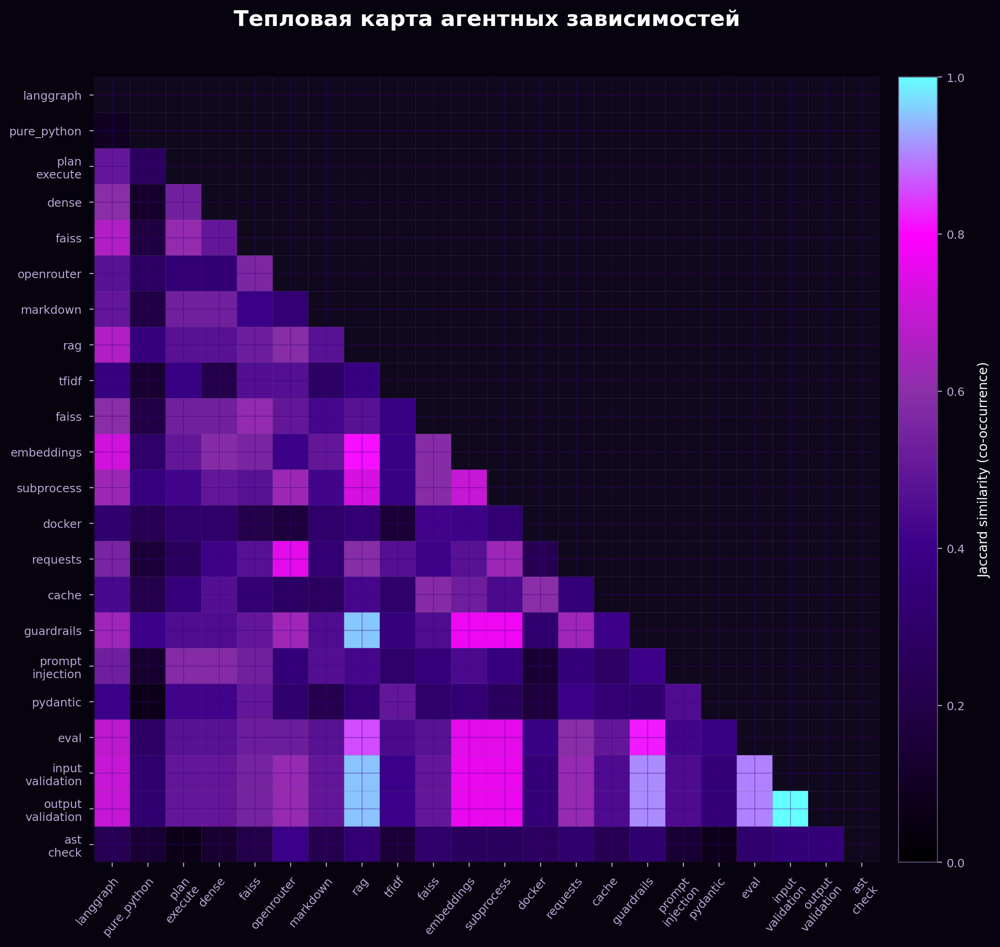

## Репозитории команд

| Team | Repo |
|---|---|
| team_01 | [KStepura/agents](https://github.com/KStepura/agents) |
| team_02 | [kre1ses/Agentic_System](https://github.com/kre1ses/Agentic_System) |
| team_03 | [timamz/data-science-agent](https://github.com/timamz/data-science-agent) |
| team_04 | [Fakhretdinov-A/ds_agent](https://github.com/Fakhretdinov-A/ds_agent) |
| team_05 | [annalzrv/rentals_downtime](https://github.com/annalzrv/rentals_downtime) |
| team_06 | [sodeniZzz/watafa-agentic-ml](https://github.com/sodeniZzz/watafa-agentic-ml) |
| team_07 | [AlexxanderrSid/Multi-agent-system-for-regression](https://github.com/AlexxanderrSid/Multi-agent-system-for-regression) |
| team_08 | [sacr1ficerq/mts-red-balls](https://github.com/sacr1ficerq/mts-red-balls) |
| team_09 | [mdkrs/mws-ai-agents](https://github.com/mdkrs/mws-ai-agents) |
| team_10 | [zaburskiyA/mws_agents](https://github.com/zaburskiyA/mws_agents) |
| team_11 | [AmKovylyaev/ai_agents_course](https://github.com/AmKovylyaev/ai_agents_course) |
| team_12 | [Bochkov1/mws-ai-agents-2026](https://github.com/Bochkov1/mws-ai-agents-2026) |
| team_13 | [While-true-codeanything/AIAgents_FinalProject_KaggleSolver](https://github.com/While-true-codeanything/AIAgents_FinalProject_KaggleSolver) |
| team_14 | [ArthurGaleev/kaggle-mas](https://github.com/ArthurGaleev/kaggle-mas) |
| team_15 | [ArthurGaleev/kaggle-mas](https://github.com/ArthurGaleev/kaggle-mas) |
| team_16 | [d4shkr/multiagent](https://github.com/d4shkr/multiagent) |
| team_17 | [sergak0/mws-ai-agents](https://github.com/sergak0/mws-ai-agents) |
| team_18 | [IoplachkinI/mts-ai-agents (GitLab)](https://gitlab.com/IoplachkinI/mts-ai-agents) |
| team_19 | [ProgiFrogi/Agentic-Modeling-Operational-Engineering-Beta-Application](https://github.com/ProgiFrogi/Agentic-Modeling-Operational-Engineering-Beta-Application) |
| team_20 | [Durakavalyanie/MTS_AI_AGENTS](https://github.com/Durakavalyanie/MTS_AI_AGENTS/) |

## Визуализации

### Поток по архитектурным измерениям

Поток команд по цепочке (фреймворк → LLM → безопасность → tier): толщина ленты — сколько команд на пути, цвет — исходная категория.

### Поток по технологическому стеку

Поток по слоям стека (фреймворк → RAG → vector DB → стратегия LLM); про связки решений, не про баллы.

### Сеть неочевидных зависимостей (PMI)

Узлы — технологии (с группировкой по смыслу), рёбра — PMI; размер узла — частота. Неочевидные созависимости, не просто популярные пары.

### Тепловая карта пересечений агентных сигналов

Jaccard между токенами (RAG/agents/tooling/runtime/safety)